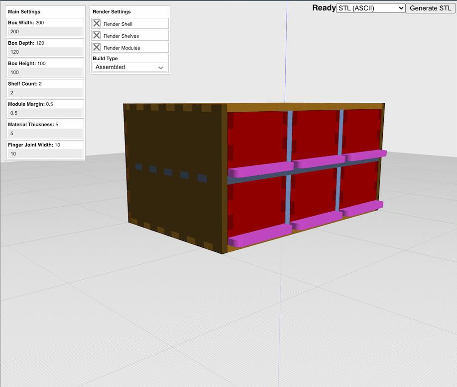

# OpenJSCAD-Templates
Parametric Design Examples

[Give parametric design a try using OpenJSCAD!](https://raw.githack.com/opencoca/OpenJSCAD-Templates/master/index.html) Parametric designs are models that can be altered by simply changing parameters.  These designs are great for if you want to change the size, appearance, or any other aspects of a design without needing to go back and remake it from scratch each time.

OpenJSCAD is an open-source program used to generate parametric models simply by writing code. That means that there are no complicated tools needed to generate complex shapes. More over OpenJSCAD runs in browser, so there is no software installation needed. The only requirement is that you have a recent browser with the HTML5 canvas element.

All of these designs are available under an GNU Affero General Public License v3.0 license, this means that they are free for commercial use as well as educational use so long as you agree to share what you create with them. 

Enjoy and create some awesome designs! 

(╯°□°）╯  ┻━┻  (_8^(I)

This README.MD is published under a Creative Commons Attribution-ShareAlike 4.0 International License. 

In short what you can do is publish, copy and distribute the contents of this repository so long as you attribute OpenCo and and other original author(s) for their work and also share your own source code under an GNU Affero General Public License v3.
